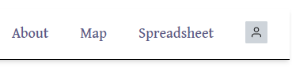
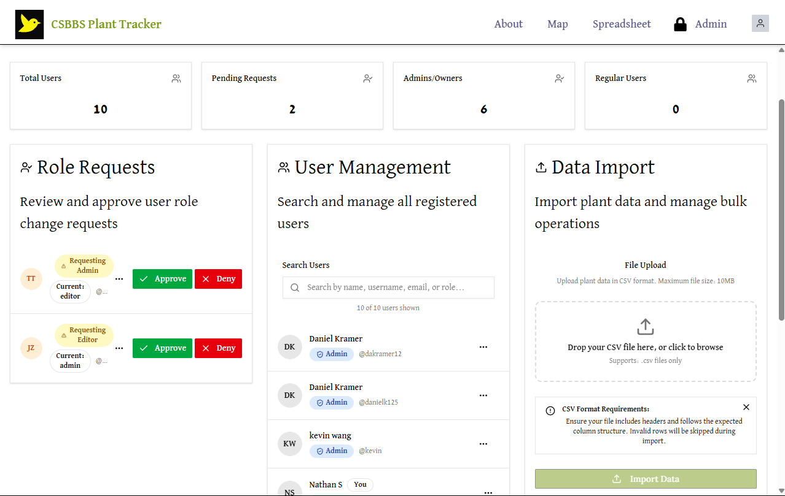
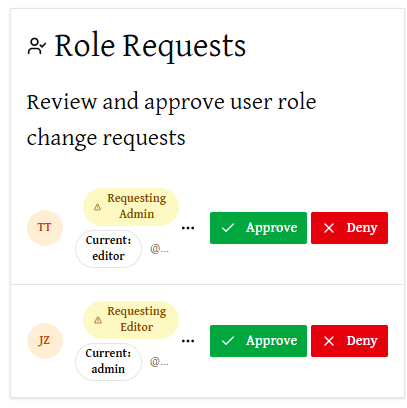
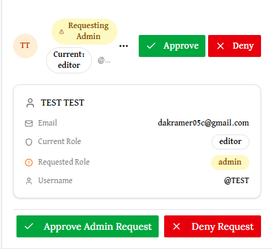
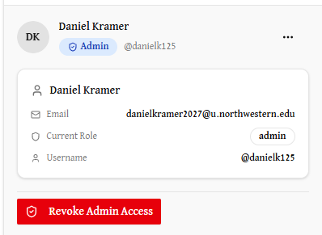
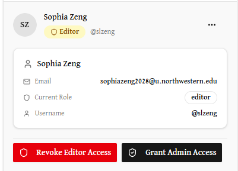
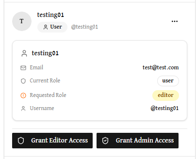
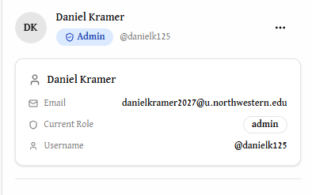
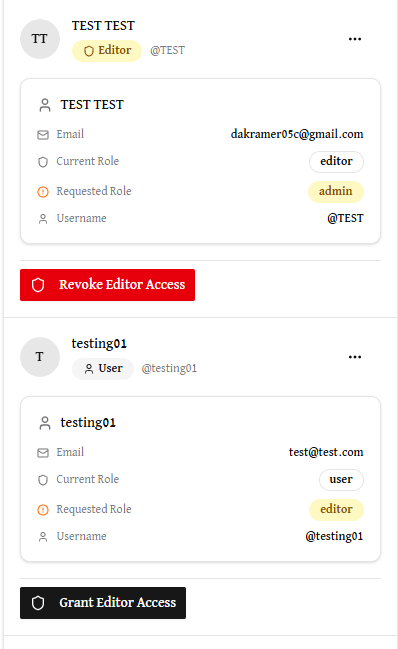
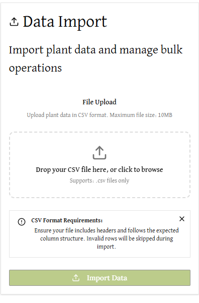

# Admin Page Guide

The Admin Page is a private webpage only accessible to those who have **admin** or **owner** permissions. If you have one of those roles, you can navigate to the Admin Page via the navigation bar at the top of the screen. If you are a **user** or an **editor**, the admin page is **not visible**.

*view for admins and owners:*

*view for editors and users:*

---
## Navigating Through the Admin Page
Once on the Admin Page, there are three distinct sections to the page. 

---
### Role Requests
The role requests panel is a separate list of users, for accounts that are actively requesting a role change. **`Users` can request to be `editor` through the `Request Permissions` button embedded within the avatar on the right side of the navigation bar.**

#### Owner and Admin View
Admins and owners can approve or deny any of these `editor` requests.

#### Additional User Info
Clicking the ellipses on any user card on the Admin Page will expand a dropdown with more information about that user, including their provided real name, email address, role, and any requested roles. 

---
### User Management List
Every user registered on the app is listed in this section. Each user is displayed as a small component in the list, with their username, role, and a set of possible actions for that user. Note that owners and admins will have a slightly different set of actions, detailed below.

#### Search Bar
A search bar above the list allows searching for users by real name, username, email, or role.

#### Owner View
Depending on the role of an account, owners can grant and revoke either editor or admin permissions:
- **If the account is an `owner`:**
  - Owners **cannot take any action** on fellow owners. 
  <!--  -->
- **If the account is an `admin`:**
  - The owner can **revoke admin** permissions, making that account an `editor`.
  
- **If the account is an `editor`:**
  - The owner can **revoke editor** permissions or **grant admin** permissions.
   
- **If the account is a `user`:**
  - The owner can **grant editor** permissions or **grant admin** permissions.
  

#### Admin View
Depending on the role of an account, admins can grant or revoke editor permissions:
- **If the account is an `owner`:**
  - Admins **cannot take any action** on owners. 
- **If the account is an `admin`:**
  - Admins **cannot take any action** on fellow admins.
  
- **If the account is an `editor`:**
  - The owner can **revoke editor** permissions.
- **If the account is a `user`:**
  - The owner can **grant editor** permissions.
  

---
### Plant CSV Importing
To help with populating the database with the various species of plant in the sanctuary, the Admin page contains functionality to take a CSV file of plant information and import each row into the database as a plant species. A file can be selected from an explorer, or dropped into the window as shown below:

The following columns **must exist** in the CSV file to properly import plants:
- plantCommonName
- plantScientificName
- isNative
- subcategory

Although the meaning of each column is reasonably self-explanatory, more details on the accepted data types and constraints on the values in each field can be found under **technical spec > database schema > PlantInfo table**. 