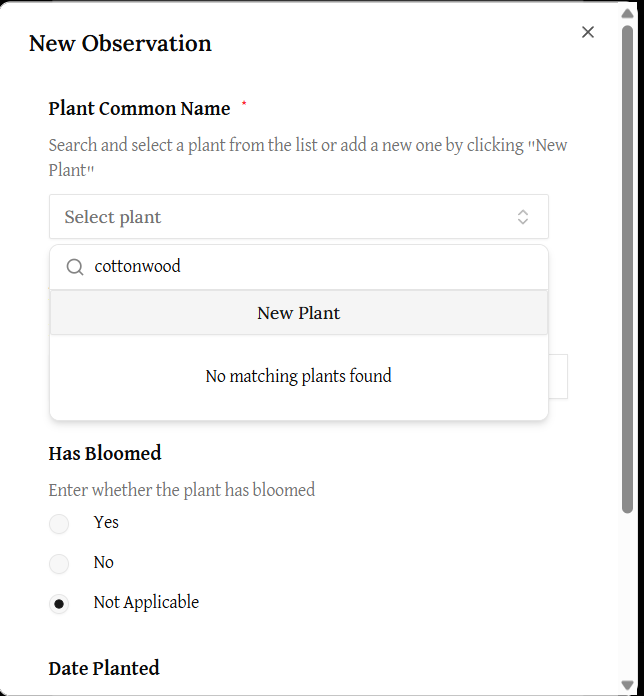
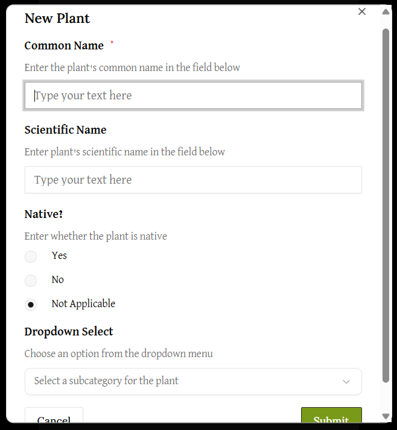

# How to create a new plant for an observation

If the plant that you want to add to an observation is not on the search dropdown when you are creating a new observation, you can add a new plant by clicking the "New Plant" button. 

When the button is clicked, a "New Plant" form will pop up. 

Fill in this form and click submit to create a new plant in the database. The fields you will need to fill are as follows:
1. Common Name (required)
    - This is the common name for the plant (like, blue orchid, for example). 
2. Scientific Name (optional)
    - If you know the common name for the plant, please add it here as well. 
3. Subcategory
    - Here, you can choose the subcategory that the plant is in as well. You can choose between Forbs, Shrubs, Tree, Grass, and Other. 

After you press submit, you should be back a the observation form. The plant you want will show when you begin searching again.