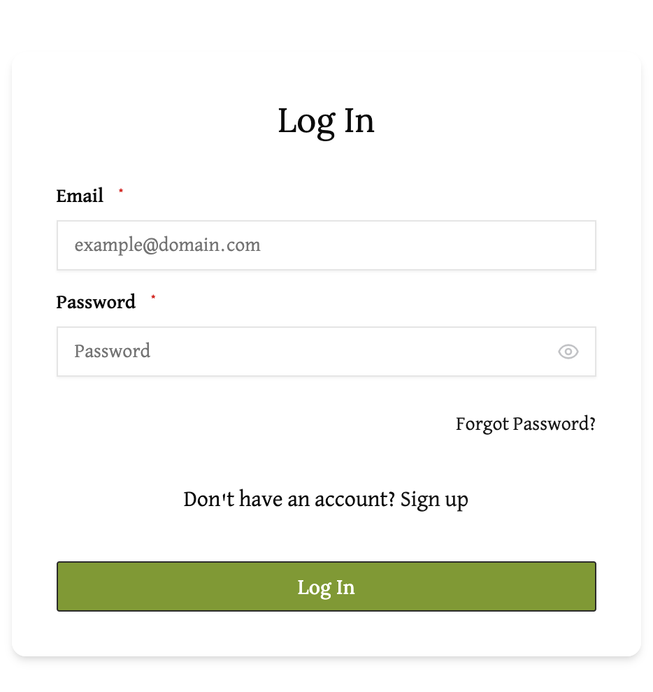

# Login Guide

To log into your existing account, navigate to the login page. You should see a form prompting you to "Log In".

Enter the following information into the respective fields:
- **Email** (required) - Enter your registered email address
- **Password** (required) - Enter your account password

The password field includes a visibility toggle (eye icon) that allows you to show or hide your password as you type.

After filling out both required fields, click the green "Log In" button to access your account.

# Forgot Password

If you have forgotten your password, click on the `Forgot Password?` link below the password field. This will take you to the password reset page where you can enter your email address to receive password reset instructions.

# Create New Account

If you don't have an account yet, click on the `Don't have an account? Sign up` link to navigate to the account creation page.

# Navigation

You can access the login page by clicking on the "Log In" tab in the navigation bar on the top right of the website.

 