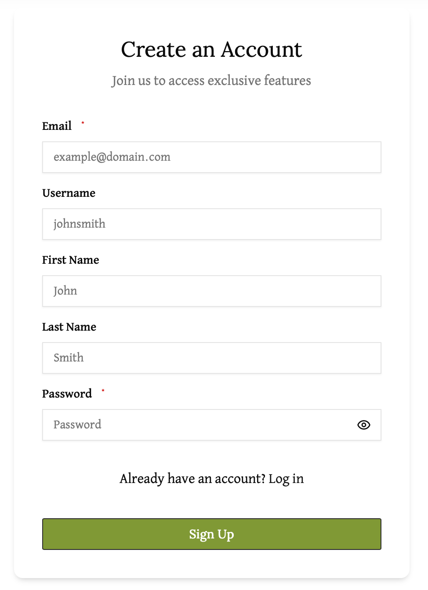

# Create an Account

To create a new account, navigate to the sign-up page. You should see a form prompting you to "Create an Account".

Enter the following information into the respective fields:
- **Email** (required)
- **Username** (required)
- **First Name** (optional)
- **Last Name** (optional)
- **Password** (required)

After filling out the required fields, click the green "Sign Up" button to create your account.

# Email confirmation

After clicking the "Sign Up" button, you will be emailed a confirmation link. Click the link to confirm your account. You should be automatically logged in after confirmation.

# Login

If you already have an account, you can click the `Log in` link to go to the login page.

# Reset Password

If you have forgotten your password, click on `Forgot Password?` Enter your email into the prompt and click on the button `Reset Password` to reset your password.  