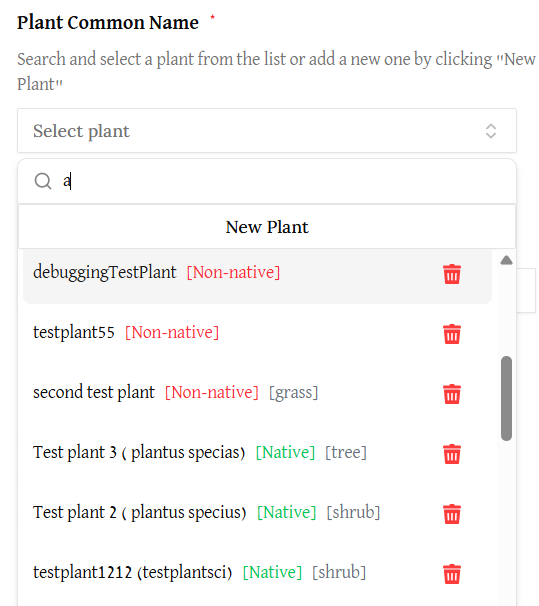

# Creating & Managing Observations

## Adding a new observation while making/editing a snapshot

To add a new observation (a plant sighting for a snapshot), click the "New Observation" button under the Plants section of any type of Snapshot modification screen. This could be for making new snapshots or editing snapshots. 

Clicking the New Observation button will lead you to a "New Observation" form that you will need to fill. 

In this from, you will see these fields:
1. Plant Common Name (required)
    - This is where you choose which plant you want this observation to be for. Do so by clicking the "Select plant" button and then typing at least one character to see a listing of possible plats

    - The list will show the plant common name, the scientific name in parentheses, whether the plant is native or non-native, and the plant type. 
    - If you cannot find the plant you are looking for, please see the [creating a new plant](./create-new-plant) page about adding a new plant when you can't find the plant you are looking for. 
2. Has Bloomed (optional)
    - Use the "Yes," "No," and "Not Applicable" radio buttons to indicate whether the plant has bloomed. This section is automatically set to "Not Applicable."
3. Date Planted (optional)
    - Click the Select a Date button and use the popup calendar to select a date planted for the plant observation. 

## Editing/Deleting Observations

- To edit an observation in a snapshot form, click then pen icon next to the observation item. This will popup a form similar to making a new observation, but with information pre-filled. 

- To delete an observation, click the trash can icon next to the observation you would like to delete. 