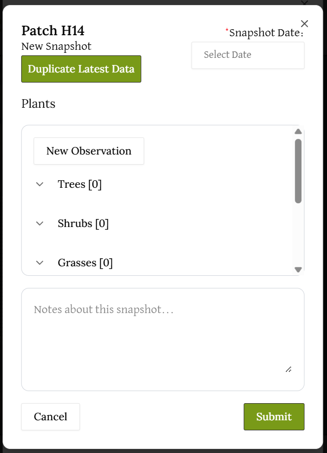

# Navigating the Map

Click on the "Map" tab in the navigation bar at the top, near the middle. This will bring you to a page with a map of the Clark Street Bird Sanctuary.

To inspect a patch, 
- click on the patch on the grid. It will be highlighted in blue and the bar on the right will display the grid patch selected, including its row and column.
- click on the "Inspect Patch" button in green on the left or the "View Latest Snapshot" button on the right bar.

To locate specific plants, the filter menu allows you to select and deselect specific plants you would like to locate in the map.

## To add a new snapshot,
- Click on the grid patch you are interested in.
- Click on the "View Latest Snapshot" green button on the right bar.
- Click on "New Snapshot" at the bottom left.

- Input a new observation of a plant if needed, any notes, the snapshot date, and click "Submit" when you are done. You may click the "Duplicate Latest Data button to duplicate the data from the latest snapshot into the current snapshot. You may edit the fields after.

Double check the patch number at the top left before submitting any data into the snapshot.

## To look at historic snapshots,
- Go back to the main view of the patch: 

- On the bottom right corner, there should be a "History" button. By clicking this button, you will be able to see a historical list of snapshots, sorted by date created.

- You can use the "View" button to pull up the past snapshot, "Edit" to make changes to that past snapshot, and "Delete" to remove the snapshot along with all the observations attached to it from the database. The Edit and View pages will be very similar to the "New Snapshot" and "Latest snapshot" pages. 