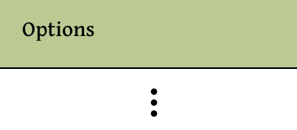
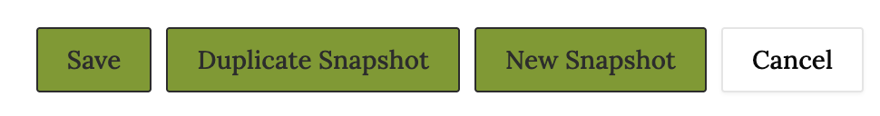

# Guide for editing observations in spreadsheet view

## Action Menu
To access editing, start by clicking the three dots under the "Options" column in the row which you would like to edit.

From there, select "Edit Observation" from the dropdown menu.

Once you click that, you can now edit "Plant Quantity", "Date Planted", and "Has Bloomed" fields for this row. To save your edits, you have three options shown below.

Clicking "Save" will save your edits in place, changing the actual observation you have edited. "Duplicate Snapshot" will duplicate the *ENTIRE* snapshot associated with the observation you are editing \(including other associated observations\) and enfore the edit in this new snapshot. "New Snapshot" will create a blank snapshot containing just the edited observation. Alternatively, "Cancel" will discard any edits you haven't save yet and will take you out of editing mode.
