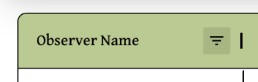
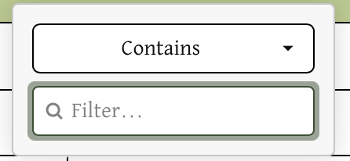
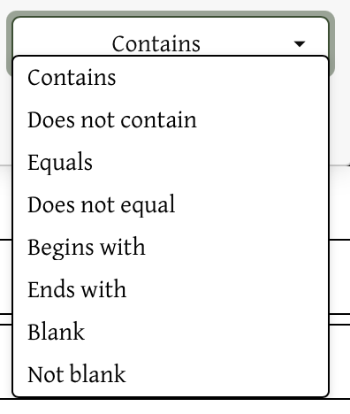
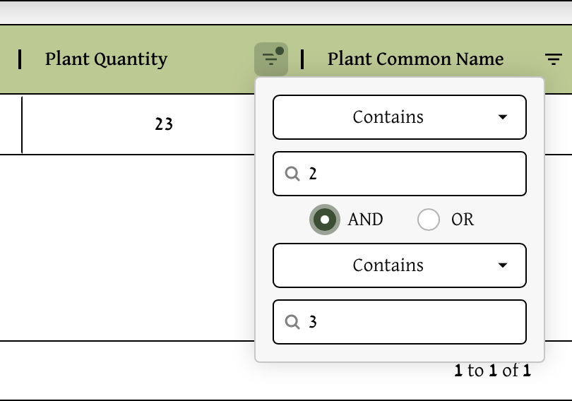
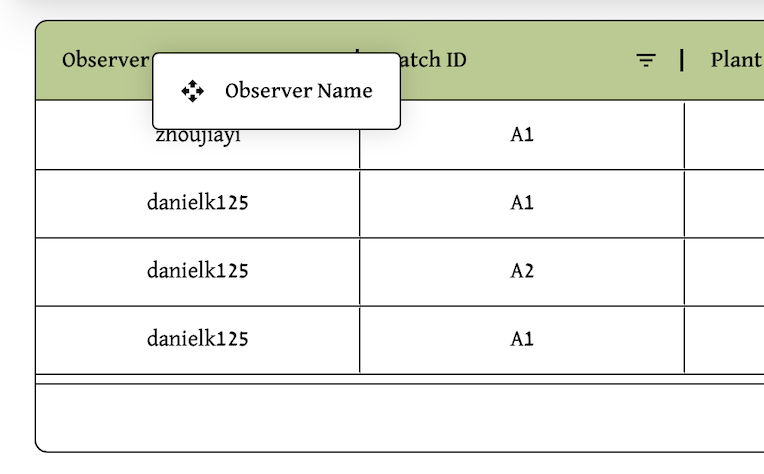
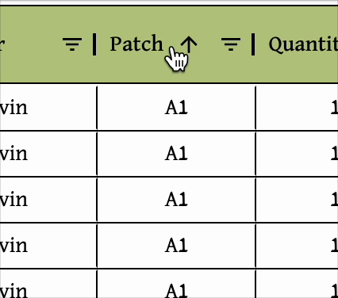

# Filtering, Reordering, and Sorting Data

## Filtering

The **triangle menu icon** next to the column headers contains filtering options for that column.

Clicking on the symbol reveals filtering options for more specificity:

With both the contains option and the input field for text, the user can choose which specific observations to view that fulfills both criteria.

Clicking on contains reveals a drop down menu with more filtering options:

After both filtering fields are filled in, more filtering options appear, allowing users to filter by multiple criteria if they wish.

 

## Reordering

To reorder columns, **click and drag** the title of the column, that is in green. This should show a box with the title of that column that users can drag around, swapping its location with surrounding columns:

## Sorting

To sort data, **click on the column header** of the column you want to sort. This will sort the data in ascending order.

To sort in descending order, **click on the column header** again.

To reset the sorting, **click on the column header** again.