# Spreadsheet Guide

### Navigating to the Spreadsheet
Click Spreadsheet on the upper right of the header:

### Navigating through the Spreadsheet
The spreadsheet contains the following columns:
- **Observation Date** *(Taken from the observation's snapshot)*
- **Observer Name**    *(Taken from the observation's snapshot)*
- **Patch ID**         *(Taken from the observation's snapshot)*
- **Plant Quantity**   
- **Plant Common Name** *(Taken from the associated plant in the database)*
- **Plant Scientific Name** *(Taken from the associated plant in the database)*
- **Date Planted**
- **Is Native**
- **Has Bloomed**
- **Subcategory** *(Taken from the associated plant in the database)*
- **Additional Notes** *(Taken from the observation's snapshot)*

More detailed information on what each field represents can be found on the **database schema** page in the **technical section** of documentation.
 
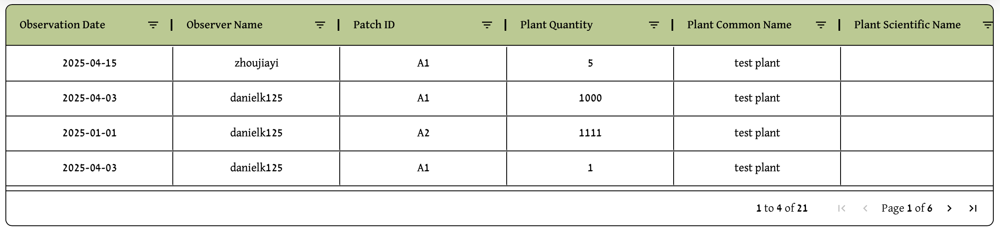

---
#### Scrolling
Not every column is visible on screen at once. To view the rest of the columns, use the **black and gray scrollbar** at the bottom of the spreadsheet window. 

---
#### Pagination
At the bottom right of the spreadsheet, users can see the pages and move through them to access the rest of the observations in the spreadsheet:

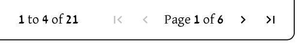

---
#### Reordering Columns
To reorder columns, **click and drag** the title of the column, that is in green. This should show a box with the title of that column that users can drag around, swapping its location with surrounding columns :

---
### Filtering Options Within a Column

The **triangle menu icon** next to the column headers contains filtering options for that column.

Clicking on the symbol reveals filtering options for more specificity:

With both the contains option and the input field for text, the user can choose which specific observations to view that fufills both.

Clicking on contains reveals a drop down menu with more filtering options:

After both filtering fields are filled in, more filtering options appear, allowing users to filter by multiple criteria if they wish.

---
## Manipulating Data
The spreadsheet contains multiple ways to interact with rows in the spreadsheet, including ways to edit, duplicate, and delete entries. Functionality can be found by clicking on the **ellipses** on the very left of the table.

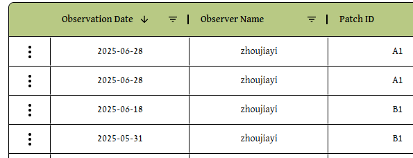

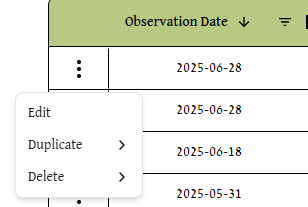
---
### New Entries
To make a new observation, click the black "New Observation" button to the top right of the spreadsheet.

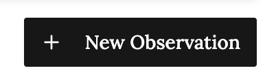

This will create a new template row at the top of the spreadsheet. The require input fields are Patch ID and Plant Common Name. It is also required that Plant Quantity be set to number higher than 0. Editable cells are highlighted in blue.

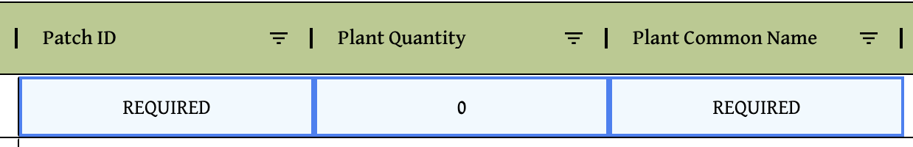

Other editable fields include "Date Planted", "Has Bloomed", and "notes. depending on the options you choose (explained below), these fields will be treated differently.

#### Saving a new observation
Pressing the "New Observation" button will cause 4 buttons to take its place. The first button is "Cancel", which will delete the template observation created when you clicked "New Observation". "New Snapshot" will generate a new, blank snapshot with just the new observation in it. This is the only case in which the "Notes" field will NOT be overwritten. "Duplicate Snapshot" will copy the snapshot informationg \(including all associated observation\) from the latest snapshot assossiated with the specified "Patch ID" and add the new observation to the copy. "Add to current snapshot" will simply add the new observation to the latest snapshot for the specified patch. In the latter two cases, the "Notes" field is overwritten to that of the latest snapshot used, since "Notes" is associated with a snapshot.

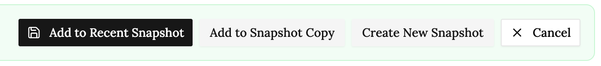
---
### Editing Entries
To access editing, start by clicking the three dots under the "Options" column in the row which you would like to edit. From there, select "Edit Observation" from the dropdown menu. 

Once you click that, Editable fields will become highllighted in blue. These are the only fields strictly associated with observations. To save your edits, you have three options shown below.

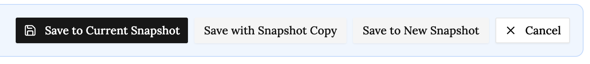

Clicking "Save" will save your edits in place, changing the actual observation you have edited. "Duplicate Snapshot" will duplicate the *ENTIRE* snapshot associated with the observation you are editing \(including other associated observations\) and enforce the edit in this new snapshot. "New Snapshot" will create a blank snapshot containing just the edited observation. Alternatively, "Cancel" will discard any edits you haven't save yet and will take you out of editing mode.

---
### Duplicating Entries

When the duplicate dropdown is hovered over, three options are present for the user to choose from.

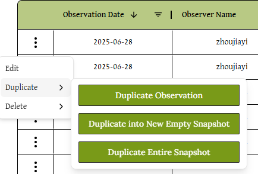

For any option the user selects, they will be presented with a dialog to **cancel** or **confirm** the action, as seen below. This also applies to delete functionality. 

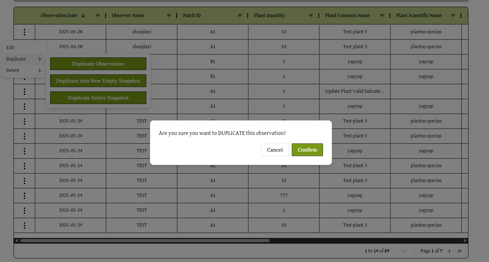

#### Duplicate Observation
If the user selects **Duplicate Observation**, an observation with identical information is copied into the same snapshot.

#### Duplicate Into New Empty Snapshot
If the user selects **Duplicate into New Empty Snapshot**, a new snapshot is created with similar information to the previous snapshot, with some differences:
- The new snapshot's creation date is set to today. 
- No notes are copied over.

This new snapshot **only contains the observation you duplicated**, and no others. 

#### Duplicate Entire Snapshot
If the user selects **Duplicate Snapshot**, the entire snapshot associated with this observation is copied. This includes making copies of every other observation in the snapshot. The **creation date** of the new snapshot is set to today.

--- 
### Deleting Entries
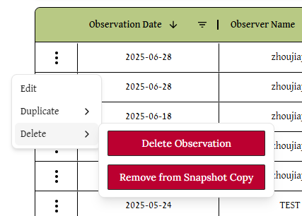

#### Delete Observation
If the user selects **Delete Observation**, the observation is removed from the current snapshot, and is no longer accessible to the user. 

#### Copy Snapshot and Remove Observation
If the user selects **Remove from Snapshot Copy**, the entire snapshot is copied, **except** for the selected observation. This is useful if you want to represent that a particular observation is no longer accurate, but that every other observation in the snapshot still is. The duplicated snapshot's creation date is set to today. 