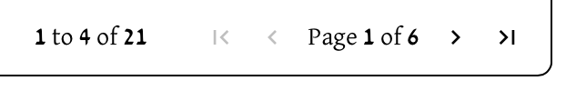
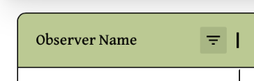
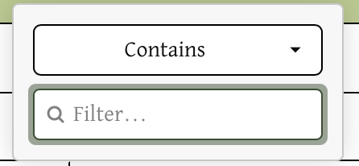
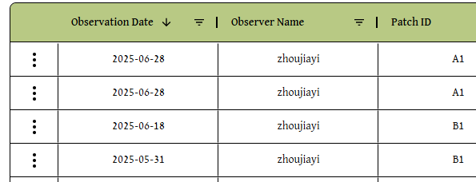
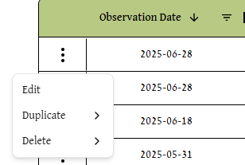
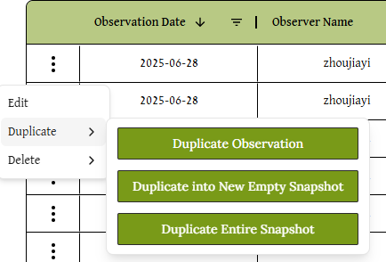
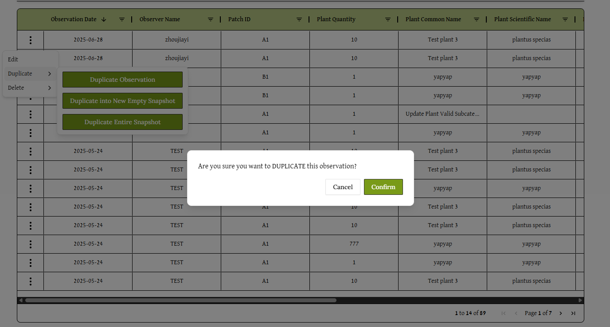
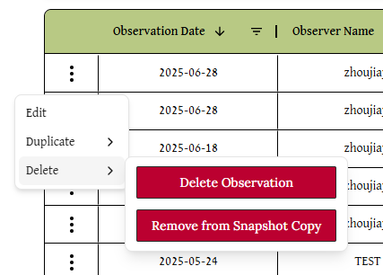

# Spreadsheet Guide

### Navigating to the Spreadsheet
Click Spreadsheet on the upper right of the header:

### Navigating through the Spreadsheet
The spreadsheet contains the following columns:
- **Observation Date** *(Taken from the observation's snapshot)*
- **Observer Name**    *(Taken from the observation's snapshot)*
- **Patch ID**         *(Taken from the observation's snapshot)*
- **Plant Quantity**   
- **Plant Common Name** *(Taken from the associated plant in the database)*
- **Plant Scientific Name** *(Taken from the associated plant in the database)*
- **Date Planted**
- **Is Native**
- **Has Bloomed**
- **Subcategory** *(Taken from the associated plant in the database)*
- **Additional Notes** *(Taken from the observation's snapshot)*

More detailed information on what each field represents can be found on the **database schema** page in the **technical section** of documentation.
 

---
#### Scrolling
Not every column is visible on screen at once. To view the rest of the columns, use the **black and gray scrollbar** at the bottom of the spreadsheet window. 

---
#### Pagination
At the bottom right of the spreadsheet, users can see the pages and move through them to access the rest of the observations in the spreadsheet:

---
#### Reordering Columns
To reorder columns, **click and drag** the title of the column, that is in green. This should show a box with the title of that column that users can drag around, swapping its location with surrounding columns :

---
### Filtering Options Within a Column

The **triangle menu icon** next to the column headers contains filtering options for that column.

Clicking on the symbol reveals filtering options for more specificity:

With both the contains option and the input field for text, the user can choose which specific observations to view that fufills both.

Clicking on contains reveals a drop down menu with more filtering options:

After both filtering fields are filled in, more filtering options appear, allowing users to filter by multiple criteria if they wish.

---
## Manipulating Data
The spreadsheet contains multiple ways to interact with rows in the spreadsheet, including ways to edit, duplicate, and delete entries. Functionality can be found by clicking on the **ellipses** on the very left of the table.

---
### Editing Entries
*Daniel here*
I would recommend talking about all the constraints on editing and why we chose those. (include reasoning about needing to keep information in separate tables in our DB).

---
### Duplicating Entries

When the duplicate dropdown is hovered over, three options are present for the user to choose from.

For any option the user selects, they will be presented with a dialog to **cancel** or **confirm** the action, as seen below. This also applies to delete functionality. 

#### Duplicate Observation
If the user selects **Duplicate Observation**, an observation with identical information is copied into the same snapshot.

#### Duplicate Into New Empty Snapshot
If the user selects **Duplicate into New Empty Snapshot**, a new snapshot is created with similar information to the previous snapshot, with some differences:
- The new snapshot's creation date is set to today. 
- No notes are copied over.

This new snapshot **only contains the observation you duplicated**, and no others. 

#### Duplicate Entire Snapshot
If the user selects **Duplicate Snapshot**, the entire snapshot associated with this observation is copied. This includes making copies of every other observation in the snapshot. The **creation date** of the new snapshot is set to today.

--- 
### Deleting Entries

#### Delete Observation
If the user selects **Delete Observation**, the observation is removed from the current snapshot, and is no longer accessible to the user. 

#### Copy Snapshot and Remove Observation
If the user selects **Remove from Snapshot Copy**, the entire snapshot is copied, **except** for the selected observation. This is useful if you want to represent that a particular observation is no longer accurate, but that every other observation in the snapshot still is. The duplicated snapshot's creation date is set to today. 