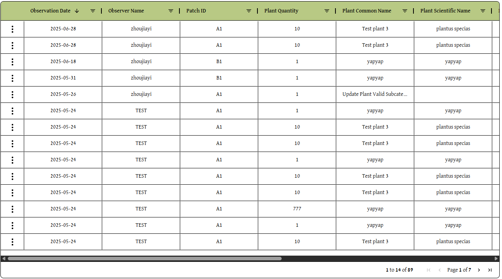
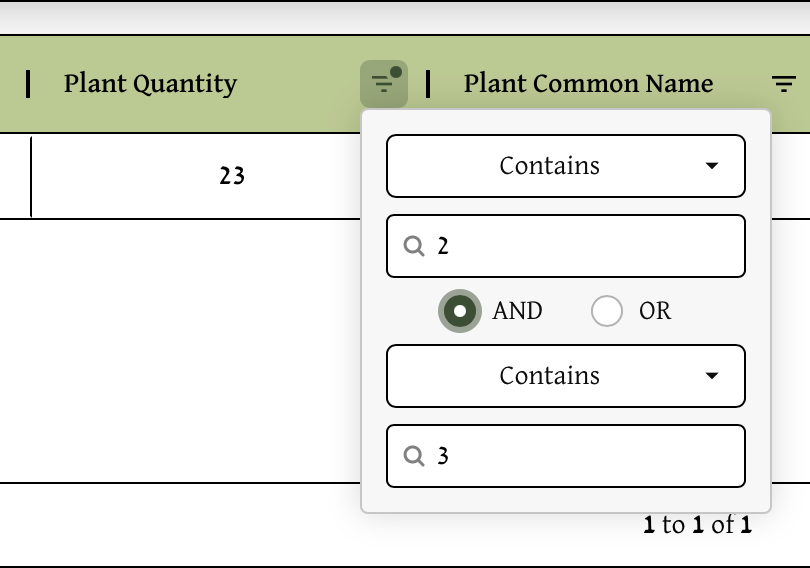

# Spreadsheet Guide

### Navigating to the Spreadsheet
Click Spreadsheet on the upper right of the header:

### Navigating through the Spreadsheet
- **Observation Date** *(Taken from the observation's snapshot)*
- **Observer Name**    *(Taken from the observation's snapshot)*
- **Patch ID**         *(Taken from the observation's snapshot)*
- **Plant Quantity**   
- **Plant Common Name** *(Taken from the associated plant in the database)*
- **Plant Scientific Name** *(Taken from the associated plant in the database)*
- **Date Planted**
- **Is Native**
- **Has Bloomed**
- **Subcategory** *(Taken from the associated plant in the database)*
- **Additional Notes** *(Taken from the observation's snapshot)*
 

---
#### Scrolling
Not every column is visible on screen at once. To view the rest of the columns, use the **black and gray scrollbar** at the bottom of the spreadsheet window. 

---
#### Pagination
At the bottom right of the spreadsheet, users can see the pages and move through them to access the rest of the observations in the spreadsheet:

---
#### Reordering and Sorting
To reorder columns, click and drag the title of the column, that is in green. This should show a box with the title of that column, allowing users to drag it, swapping its location with surrounding columns :

### Filtering Options Within a Column

The title header for the spreadsheet table lists the name of the column and on the right of each column, the lined triangle symbol allows for filtering of the column when clicked:

Clicking on the symbol reveals filtering options for more specificity:

With both the contains option and the input field for text, the user can choose which specific observations to view that fufills both.

Clicking on contains reveals a drop down menu:

After both filtering fields are filled in, there are more options that appear, that lets users choose if they want to filter by multiple options:

