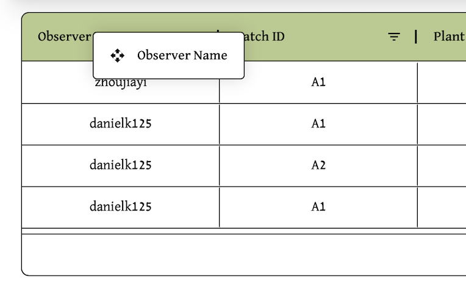
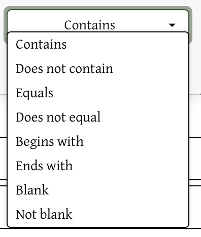

# Spreadsheet Guide

### Navigating to the Spreadsheet
Click Spreadsheet on the upper right of the header:

### Navigating through the Spreadsheet
The page shows all volunteer observations in a spreadheet. Fields that are included are:
- list fields here

The table has fields continuing to the right, so scroll right to view more columns, once you are scrolling, a scroll bar appears at the bottom of the table to allow for easier scrolling:

At the bottom right of the spreadsheet, users can see the pages and move through them to access all observations:

To reorder columns, click and drag the title of the column, that is in green. This should show a box with the title of that column, allowing users to move it:

### Filtering Options Within a Column

The title header for the spreadsheet table lists the name of the column and on the right of each column, the lined triangle symbol allows for filtering of the column when clicked:

Clicking on the symbol reveals filtering options for more specificity:

With both the contains option and the input field for text, the user can choose which specific observations to view that fufills both.

Clicking on contains reveals a drop down menu:

After both filtering fields are filled in, there are more options that appear, that lets users choose if they want to filter by multiple options:

